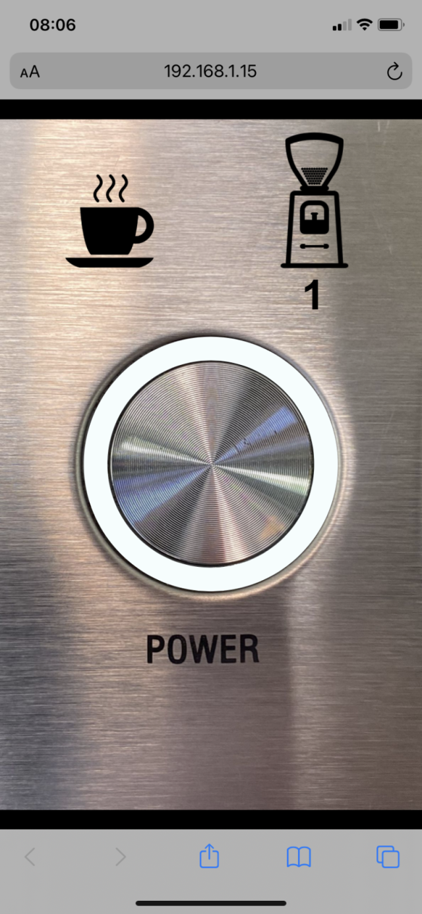

# Wi-Fi enabled coffee machine




The screenshot show the user interface. The machine is on and heating up. When the machine is ready, the grinder will grind enough grounds for one cup of coffee. 

## Hardware

See section on [hardware hacking](/hardware/README.md).

## Software

The solution consists of two software components:
1. A web service implemented using Node.js and [BoneScript](https://beagleboard.org/Support/BoneScript/) listing on port 8081.
2. A static web page served up by the preinstalled Nginx webserver listening on port 8080.

### Flashing the BBGW

Flash the BBGW with the [Debian 10.3 image](https://debian.beagleboard.org/images/bone-eMMC-flasher-debian-10.3-iot-armhf-2020-04-06-4gb.img.xz)

### Configure Wi-Fi and static IP address

Connect the BBGW to the PC via USB. Then access it via SSH on 192.168.7.2. Default username:password is debian:temppwd.

```
$ sudo connmanctl
connmanctl> enable wifi
connmanctl> scan wifi
connmanctl> services
connmanctl> agent on
connmanctl> connect wifi_884aea627540_4e69656c73656e34_managed_psk
connmanctl> services
```
Confirm there is a *AO or *AR next to the Nexwork ID
```
connmanctl> config wifi_884aea627540_4e69656c73656e34_managed_psk --ipv4 manual 192.168.1.15 255.255.255.0 192.168.1.1
connmanctl> config wifi_884aea627540_4e69656c73656e34_managed_psk --nameservers 8.8.8.8 8.8.4.4
connmanctl> quit
```

Reference: https://www.fis.gatech.edu/how-to-configure-bbw-wifi/

### Install software

Install required Epoll node module
```
$ sudo npm install -g epoll --unsafe-perm=true --allow-root
```
Clone repository and copy files to default locations for NGinx web server and Cloud9 autorun:
```
$ git clone https://github.com/nielsenamrose/wifi-coffee.git
$ cd wifi-coffee
$ sudo cp html /var/www/ -r
$ sudo cp server.js /var/lib/cloud9/autorun/
```

## Future improvements

As a future improvement I would like to show a total count of cups brewed. The count should include cups brewed using the app and cups brewed by manually pressing the button on the machine. If the server can know when the machine is brewing, that would also allow the software to correctly handle the case, where brewing is initiated from the app but interrupted by a button press on the machine.
