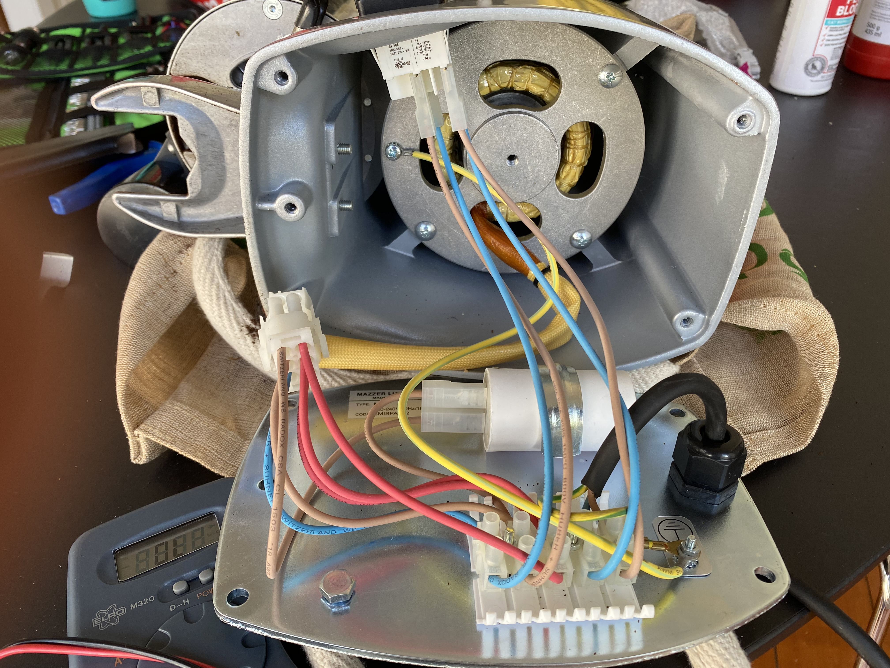
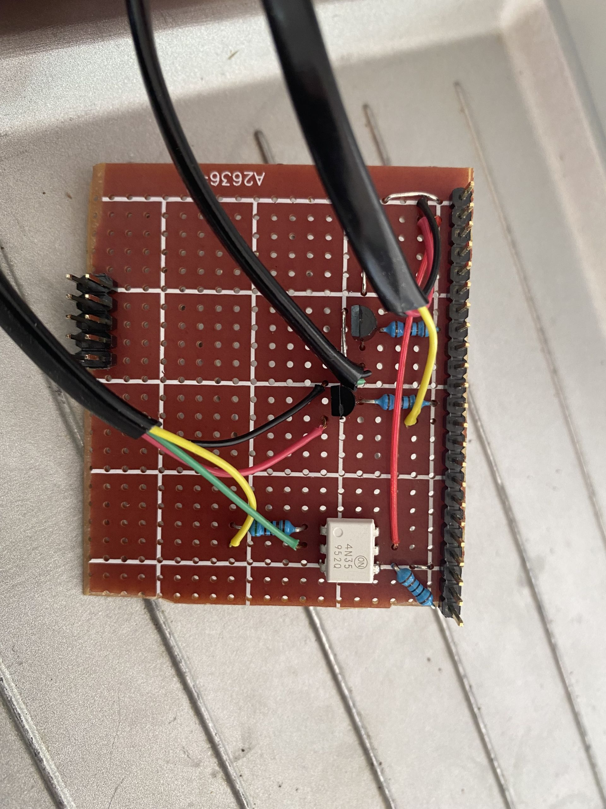
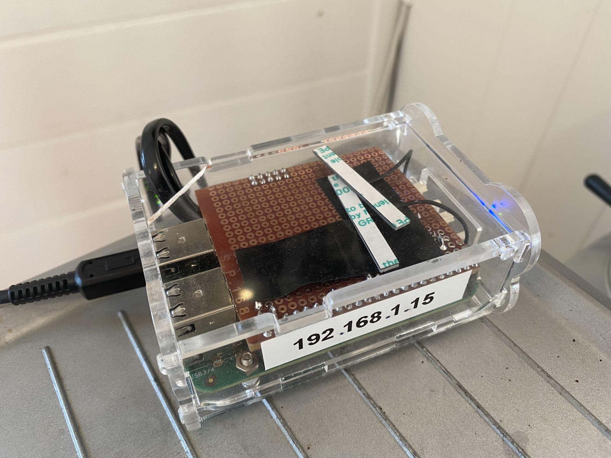
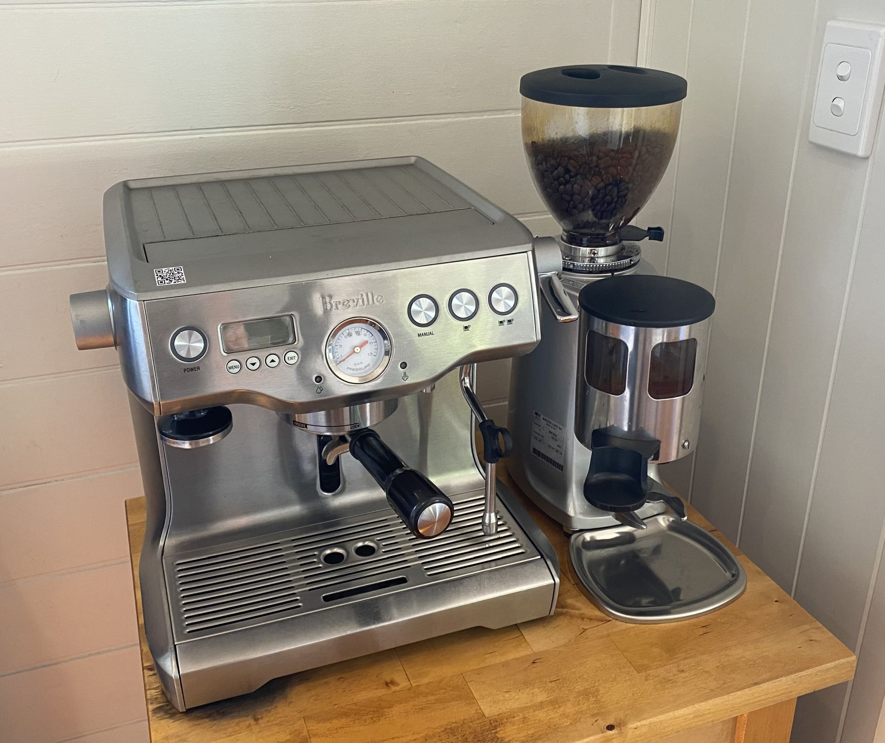

# Hardware

## Setup

The setup consists of the following components:

- Coffee machine: **Breville BES920 Dual Boiler**
- Grinder: **Mazzer Mini Manual Grinder**
- Single board computer: **BeagleBone Green Wireless**
- A controller PCB added as a cape to the single board computer
- 2 250V 10A AC relays added to the grinder

## Controller

We will controll the following 

- Coffee machine power button
- Coffee machine "manual" brew button
- Grinder ON/OFF button

We will read the following inputs

- Coffee machine power LED

### Schematics

#### Button circuit

We use a NPN transistor as an electronic switch. We connect the transistor parallel to the physical switch in the coffee machine to allow both manual and remote operation.

#### Grinder ON/OFF relays

#### LED input circuit

The LED in the coffee machine has a current limiting resistor. We will detect current through the resistor by connecting it to the input of an optocouple. Note that the cathode  of the LED is not connected to ground and the circuitry in the coffee machine is unknown, hence why we use the optocoupler.

## Intallation

Grinder innards.

Grinder innards with relays mounted.

Bread board used for testing.

Electronics placed on a pcb designed as a BeagleBone cape. The left 2x5 connector is just added for stability.

The cape mounted on the BeagleBone and placed in the enclosure.

And finally everything is neatly put back together

