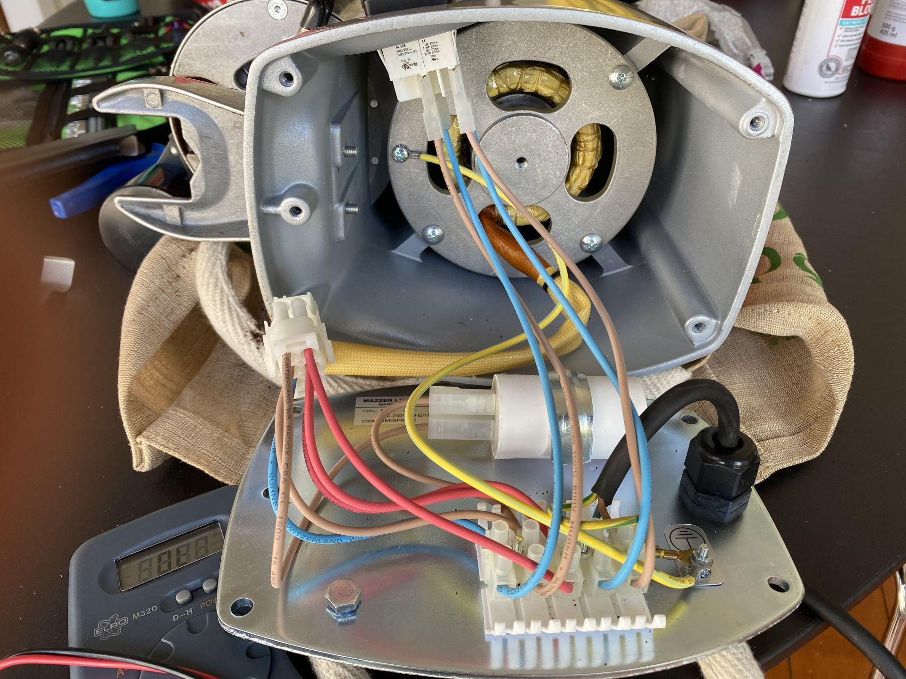

# Hardware

## Setup

The setup consists of the following components:

- Coffee machine: **Breville BES920 Dual Boiler**
- Grinder: **Mazzer Mini Manual Grinder**
- Single board computer: **BeagleBone Green Wireless**
- A controller PCB added as a cape to the single board computer
- 2 250V 10A AC relays added to the grinder

## Controller

We will controll the following 

- Coffee machine power button
- Coffee machine "manual" brew button
- Grinder ON/OFF button

The added electronics will be connected in parallel to the physical buttons to allow both manual and remote operation.

We will read the following inputs

- Coffee machine power LED
- Coffee machine "manual" brew button LED

### Schematics

## Intallation

